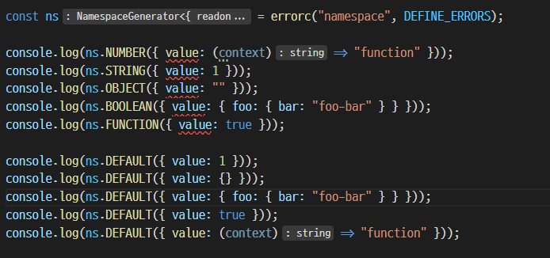

# error-c

## What is this package do?

error-c is constant based error define micro framework, you can define error with message(dynamic) more staticaly and safely on typescript.

The goal of packages is similar to that of typeScript.

When your using typescript, perhaps you want to generate **SAFER** code through static type analysis.

However, think about this

```ts
const DEFINE_ERRORS = {
  E0001: "This is error!",
  E0002: "I'm error too!",
  E0003: "I'm ${whoareyou}!",
  E0004: "I'm not ${notyou}, i'm ${whoareyou}!",
};
```

The goal of the definition of this code is clear.

You want to use error with **dynamicaly generated message**

However, there is no way to know what value is needed for the message of that particular error code.

Until now, not now.

Thanks for typescript `infer`, now we can guess what values are needed for errors

> If you're not using typescript, you don't need to use this package **at all**.

Look at this, _it's also in the examples folder_.

```ts
import errorc from "error-c";

const DEFINE_ERRORS = {
    E0001: "This is error!",
    E0002: "I'm error too!",
    E0003: "I'm ${whoareyou}!",
    E0004: "I'm not ${notyou}, i'm ${whoareyou}!",
} as const;

const fail = errorc(
    "namespace",
    DEFINE_ERRORS,
    {
        defaultMode: "release",
    }
);

console.log(fail.E0004({ notyou: "pizza", whoareyou: "potato" }));
```

That code is simply a generate error message function that create by automated generator.

It's ok, but the generator is very powerful than your thought

Imagine that you accidentally wrote a value into the "noryou" field instead of the "notyou" field.

This is a common mistake in practice.


This code throws a compile error.

Or, you don't know which fields are in a particular error code.

Now you can, see below


This magic make by typescript feature, no additional plugins, no automated build scripts.

All you need to do now is modify `DEFINE_ERRORS`. Typescript takes care of the rest.

## How to use?

---
### Define

First of all, to use this library, you need to define it.

You can define it like the code below.

```ts
import { Define } from "error-c";

const DEFINE_ERRORS = {
  SIMPLE0: "This is error!",
  SIMPLE1: "I'm not ${notyou}, i'm ${whoareyou}!",
  // You can define nested object
  INNER : {
    HELLO : "Inner hello?",
    RENNI :{
      HELLO : "Inner.Inner hello?",
    }
  }
} as const;
```

> **WARNING**
>
> `as const` is **VERY IMPORTANT** never take it off

**Importantly, DO NOT explicitly define types.**


---
### Generate 

After writing the definition, the next thing to do is create an error generating function.

You can do this simply as below.

```ts
import errorc, {FunctionGenerator, NamespaceGenerate} from "error-c";

const DEFINE_ERRORS = {
    E0001: "Hello, world!",
    E0002: "I'm ${whoareyou}!",
    INNER: {
        INNER_ERROR: "inner error"
    },
} as const;

const fnStyle = errorc(DEFINE_ERRORS);
// or
// const fnStyle = errorc("function", DEFINE_ERRORS);
// or
// const fnStyle = FunctionGenerator(DEFINE_ERRORS);
const nsStyle = errorc("namespace", DEFINE_ERRORS);
// or
// const nsStyle = NamespaceGenerate(DEFINE_ERRORS);

// > Hello, world!
console.log(fnStyle("E0001", {}))
console.log(nsStyle.E0001())

// > I'm potato!
console.log(fnStyle("E0002", {whoareyou : "potato"}))
console.log(nsStyle.E0002({whoareyou : "potato"}))

// > inner error
console.log(fnStyle("INNER.INNER_ERROR", {}))
console.log(nsStyle.INNER.INNER_ERROR())
```

Now you can generate error messages in the following way.

```ts
fail("E0003", { whoareyou: "potato" });
```


--- 
### Conditional message

```ts
import errorc from "error-c"

const DEFINE_ERRORS = {
    CONDMSG: { release: "hello, release", debug: "hello, debug" }
} as const;

const noDefault = errorc("namespace", DEFINE_ERRORS);
const defaultIsDebug = errorc("namespace", DEFINE_ERRORS, { defaultMode: "debug", });
const defaultIsRelease = errorc("namespace", DEFINE_ERRORS, { defaultMode: "release", });

console.log(noDefault.CONDMSG());                   // expected : 'hello, release'
console.log(noDefault.CONDMSG("debug"));            // expected : 'hello, debug'
console.log(noDefault.CONDMSG("release"));          // expected : 'hello, release'
console.log(defaultIsDebug.CONDMSG());              // expected : 'hello, debug'
console.log(defaultIsDebug.CONDMSG("debug"));       // expected : 'hello, debug'
console.log(defaultIsDebug.CONDMSG("release"));     // expected : 'hello, release'
console.log(defaultIsRelease.CONDMSG());            // expected : 'hello, release'
console.log(defaultIsRelease.CONDMSG("debug"));     // expected : 'hello, debug'
console.log(defaultIsRelease.CONDMSG("release"));   // expected : 'hello, release'
```
You can create conditional messages.
Currently, only `debug` and `release` are available.
If there is no `defaultMode`, it is `release` .

---
### types

This is useful if you want to allow only certain types of messages.

```ts
import errorc from "error-c"

export type DefaultType =
    | bigint
    | number
    | string
    | object
    | boolean
    | ((context: Record<string, any>) => string);

const DEFINE_ERRORS = {
    NUMBER: "${value:number}",
    STRING: "${value:string}",
    OBJECT: "${value:object}",
    BOOLEAN: "${value:boolean}",    // boolean
    FUNCTION: "${value:function}",  // (context : Record<string, any>) => string
    DEFAULT: "${value}",            // infer as `DefaultType`
} as const;

const ns = errorc("namespace", DEFINE_ERRORS);

console.log(ns.NUMBER({ value: 1 }));
console.log(ns.STRING({ value: "" }));
console.log(ns.OBJECT({ value: { foo: { bar: "foo-bar" } } }));
console.log(ns.BOOLEAN({ value: true }));
console.log(ns.FUNCTION({ value: (context) => "function" }));

console.log(ns.DEFAULT({ value: 1 }));
console.log(ns.DEFAULT({ value: {} }));
console.log(ns.DEFAULT({ value: { foo: { bar: "foo-bar" } } }));
console.log(ns.DEFAULT({ value: true }));
console.log(ns.DEFAULT({ value: (context) => "function" }));
```


> **WARNING**
>
> The type provided by errorc is not a typescript type, 
> 
> But a type defined separately by errorc.
> 
> Don't confuse this.

---

### `release` | `debug`, conditional messaging

Depending on the current application state, you may want to display a different message.

Typically, when debugging, you may want to show **secret** information in an error message.

In this case, if you use the second parameter of the `errorc` function, you can automatically display a different message during debugging and release.

```ts
import errorc from "error-c";

const DEFINE_ERRORS = {
  E0003: "I'm ${whoareyou}!",
} as const;

const fail = errorc(
  DEFINE_ERRORS,
  process.env.NODE_ENV === "production" ? "release" : "debug",
  (msg) => msg
);
```

The code above is how to determine whether to display a debugging message or a release message using NODE_ENV.

Of course, you can define whatever you want.

---

### Redefinition output type

If you want the `fail` function to return an `Error` type, you can write the code as below.

```ts
import errorc from "error-c";

const DEFINE_ERRORS = {
  ...
} as const;

const fail = errorc(
  DEFINE_ERRORS,
  process.env.NODE_ENV === "production" ? "release" : "debug",
  (msg) => new Error(msg)
);
```

This way, the fail function that originally returned `string` will now return an `Error` type.

> `msg` is `string`

---

The signature of the fail function to which all these functions are applied is as follows.


First parameter(`Key`) is one of `E0001`, `E0002`, `E0003`, `E0004`
Second parameter(`Context`) can be different from time to time depending on the first parameter.

For example, if `E0004`, the context is an object that can only put `notyou`, `whoareyou`.

## More examples

- [Simple example](https://github.com/iamGreedy/error-c/blob/main/examples/ex00.ts)

- [Release/Debug switch example](https://github.com/iamGreedy/error-c/blob/main/examples/ex01.ts)

- [type, message handing example](https://github.com/iamGreedy/error-c/blob/main/examples/ex02.ts)

## How does it work?

I stumbled across some interesting code [here](https://www.typescriptlang.org/play?ts=4.1.0-dev.20201028#example/string-manipulation-with-template-literals)

```ts
type ExtractSemver<SemverString extends string> =
  SemverString extends `${infer Major}.${infer Minor}.${infer Patch}`
    ? { major: Major; minor: Minor; patch: Patch }
    : { error: "Cannot parse semver string" };
```

Surprisingly, typescript able to cut some of the parts from literals.

Using this, I cut and pasted literal, and created the package by using generics as a kind of function.

I think this method will be useful for text template libraries like internationalization(i18n).

## Why a framework and not a library?

To implement this feature, i use typescript `const assertion`.
This is essential for implementation.

So, to use this **framework**, you must specify the value as `const assertion`.

The detailed technic described below, but to put it simply, you must follow certain rules to use the feature.

So it is framework, not library, but **very** small

However it's not important. you can just think whatever you want.
