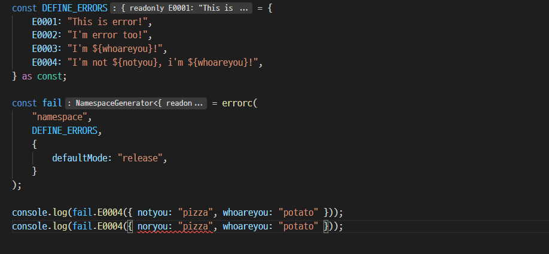
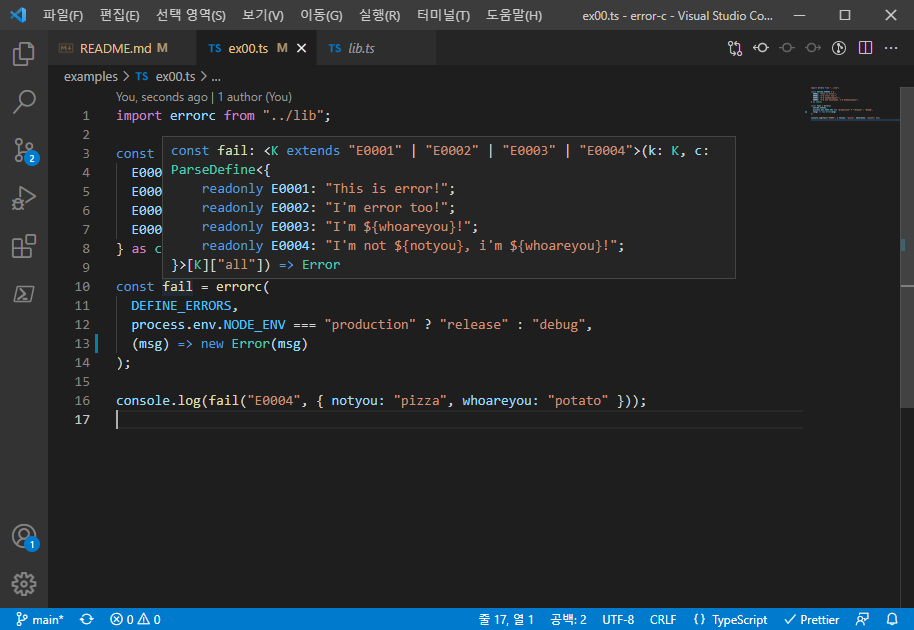

# error-c

## What is this package do?

error-c is constant based error define micro framework, you can define error with message(dynamic) more staticaly and safely on typescript.

The goal of packages is similar to that of typeScript.

When your using typescript, perhaps you want to generate **SAFER** code through static type analysis.

However, think about this

```ts
const DEFINE_ERRORS = {
  E0001: "This is error!",
  E0002: "I'm error too!",
  E0003: "I'm ${whoareyou}!",
  E0004: "I'm not ${notyou}, i'm ${whoareyou}!",
};
```

The goal of the definition of this code is clear.

You want to use error with **dynamicaly generated message**

However, there is no way to know what value is needed for the message of that particular error code.

Until now, not now.

Thanks for typescript `infer`, now we can guess what values are needed for errors

> If you're not using typescript, you don't need to use this package **at all**.

Look at this, _it's also in the examples folder_.

```ts
import errorc from "error-c";

const DEFINE_ERRORS = {
  E0001: "This is error!",
  E0002: "I'm error too!",
  E0003: "I'm ${whoareyou}!",
  E0004: "I'm not ${notyou}, i'm ${whoareyou}!",
} as const;

const fail = errorc(
  DEFINE_ERRORS,
  process.env.NODE_ENV === "production" ? "release" : "debug",
  (msg) => msg
);

console.log(fail("E0004", { notyou: "pizza", whoareyou: "potato" }));
```

That code is simply a generate error message function that create by automated generator.

It's ok, but the generator is very powerful than your thought

Imagine that you accidentally wrote a value into the "noryou" field instead of the "notyou" field.

This is a common mistake in practice.



This code throws a compile error.

Or, you don't know which fields are in a particular error code.

Now you can, see below


This magic make by typescript feature, no additional plugins, no automated build scripts.

All you need to do now is modify `DEFINE_ERRORS`. Typescript takes care of the rest.

## How to use?

### Getting start

You must follow object rule supported by this package.

In typescript code, this is the structure.

```ts
type ConditionMessage = {
  release: string;
  debug: string;
};
type Define = Record<string | number | symbol, string | ConditionMessage>;
```

You just need to define a constant object that conforms to this type.

A simple example is below.

```ts
import { Define } from "error-c";
const DEFINE_ERRORS: Define = {
  E0001: "I'm not ${notyou}, i'm ${whoareyou}!",
  E0001: {
    release: "Release : ${relmsg}",
    debug: "Debug : ${dbgmsg}",
  },
} as const;
```

### Caution

In fact, these types are supported by packages, but should not be used when defining an object.

You should not write code like below.

```ts
import { Define } from "error-c";
// Wrong, Cause `:Define`
const DEFINE_ERRORS: Define = {
  E0001: "This is error!",
  E0002: "I'm error too!",
  E0003: "I'm ${whoareyou}!",
  E0004: "I'm not ${notyou}, i'm ${whoareyou}!",
} as const;
```

There is no syntactical problem, but if you define it like this, some of the information tracked by typescript will disappear and it will not work properly.

**Importantly, never explicitly specify a type.**

---

### Syntax

The basic syntax is similar to javascript's [Template literals(Mozilla)](https://developer.mozilla.org/en-US/docs/Web/JavaScript/Reference/Template_literals).

But, here is an additional syntax for specifying types.

```ts
const DEFINE_ERRORS: Define = {
  NUMBER: "${value:number}",
  STRING: "${value:string}",
  OBJECT: "${value:object}",
  DEFAULT: "${value}",
} as const;
```

> **After defining the value, `as const` is required. Be careful not miss**

In this case, typescript can know that field needs that type.

If no type is specified, the type is assumed to be default type.

Default type is `string | number | object`

A type not specified here is assumed to be the default type string.


We can infer that `value` specified by `number` can only contain `number` value.

> [union types](https://www.typescriptlang.org/docs/handbook/2/everyday-types.html#union-types) won't work.
> To be precise, it doesn't recognize anything other than the types I've defined. This is not possible with typescript syntax.

```ts
const DEFINE_ERRORS: Define = {
  DORL: {
    release: "rel : ${value}",
    debug: "dbg : ${value}",
  },
} as const;
```

You can also create conditional messages.
Currently, only `debug` and `release` are available.

This is useful when you want more information to debugging.

---

### Generate `fail` function

After writing the definition, the next thing to do is create an error generating function.

You can do this simply as below.

```ts
import errorc from "error-c";

const DEFINE_ERRORS = {
  E0003: "I'm ${whoareyou}!",
} as const;

const fail = errorc(DEFINE_ERRORS, "release", (msg) => msg);
```

Now you can generate error messages in the following way.

```ts
fail("E0003", { whoareyou: "potato" });
```

---

### `release` | `debug`, conditional messaging

Depending on the current application state, you may want to display a different message.

Typically, when debugging, you may want to show **secret** information in an error message.

In this case, if you use the second parameter of the `errorc` function, you can automatically display a different message during debugging and release.

```ts
import errorc from "error-c";

const DEFINE_ERRORS = {
  E0003: "I'm ${whoareyou}!",
} as const;

const fail = errorc(
  DEFINE_ERRORS,
  process.env.NODE_ENV === "production" ? "release" : "debug",
  (msg) => msg
);
```

The code above is how to determine whether to display a debugging message or a release message using NODE_ENV.

Of course, you can define whatever you want.

---

### Redefinition output type

If you want the `fail` function to return an `Error` type, you can write the code as below.

```ts
import errorc from "error-c";

const DEFINE_ERRORS = {
  ...
} as const;

const fail = errorc(
  DEFINE_ERRORS,
  process.env.NODE_ENV === "production" ? "release" : "debug",
  (msg) => new Error(msg)
);
```

This way, the fail function that originally returned `string` will now return an `Error` type.

> `msg` is `string`

---

The signature of the fail function to which all these functions are applied is as follows.



First parameter(`Key`) is one of `E0001`, `E0002`, `E0003`, `E0004`
Second parameter(`Context`) can be different from time to time depending on the first parameter.

For example, if `E0004`, the context is an object that can only put `notyou`, `whoareyou`.

## More examples

- [Simple example](https://github.com/iamGreedy/error-c/blob/main/examples/ex00.ts)

- [Release/Debug switch example](https://github.com/iamGreedy/error-c/blob/main/examples/ex01.ts)

- [type, message handing example](https://github.com/iamGreedy/error-c/blob/main/examples/ex02.ts)

## How does it work?

I stumbled across some interesting code [here](https://www.typescriptlang.org/play?ts=4.1.0-dev.20201028#example/string-manipulation-with-template-literals)

```ts
type ExtractSemver<SemverString extends string> =
  SemverString extends `${infer Major}.${infer Minor}.${infer Patch}`
    ? { major: Major; minor: Minor; patch: Patch }
    : { error: "Cannot parse semver string" };
```

Surprisingly, typescript able to cut some of the parts from literals.

Using this, I cut and pasted literal, and created the package by using generics as a kind of function.

I think this method will be useful for text template libraries like internationalization(i18n).

## Why a framework and not a library?

To implement this feature, i use typescript `const assertion`.
This is essential for implementation.

So, to use this **framework**, you must specify the value as `const assertion`.

The detailed technic described below, but to put it simply, you must follow certain rules to use the feature.

So it is framework, not library, but **very** small

However it's not important. you can just think whatever you want.
